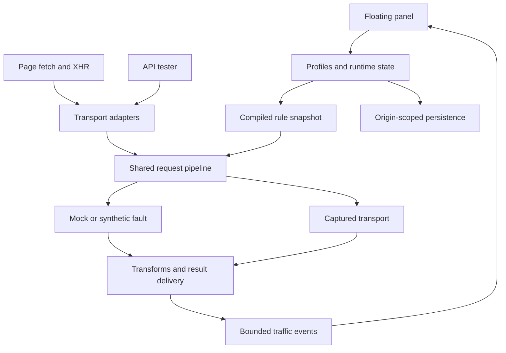
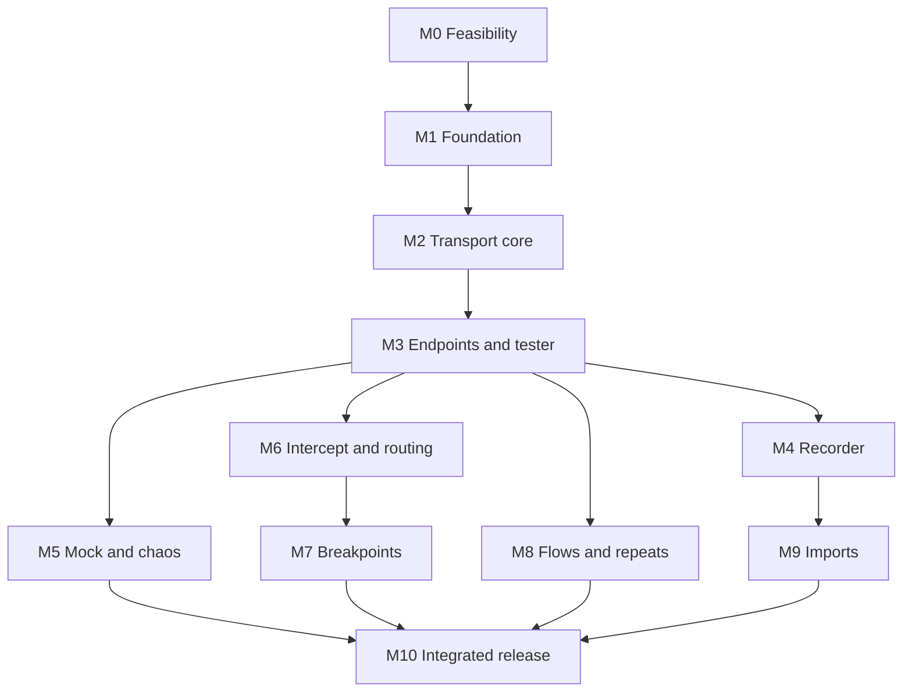

# API Workbench — Product and implementation plan

Planning date: 22 September 2026  
Status: proposed implementation contract, grounded in the supplied designs and the three subsequently supplied README photographs. Updated to include Independent execution, mock sequences, request replay, additional built-ins, module-only build recipes, and an explicit implementation/acceptance contract for every feature in `Import.html`. This document describes planned behavior; it does not claim that a working bookmarklet has been built or browser-tested.

## 1. Confirmed direction

API Workbench is a fully self-contained browser bookmarklet that opens a floating panel in the current page. It lets developers send API requests, record supported page traffic, mock responses, transform requests and responses, set breakpoints, reroute requests, and inject faults using the browser context of that page.

The following choices were confirmed during planning:

| Decision | Agreed direction |
|---|---|
| Distribution | The bookmark contains all executable code and required assets. No hosted JavaScript loader. |
| Initial browser support | Desktop Chrome and Edge. Record exact tested versions at release. |
| First public release | All features represented in the supplied screens and added capability references, implemented through internal milestones. |
| Visual reference | All 16 HTML files plus the supplied `aw-theme.css`; README photographs supply additional feature requirements. |

Working assumptions: zero dependencies means **zero runtime packages, runtime asset downloads, backend services, or extension requirements**. TypeScript, a bundler, and browser test tools may be development dependencies. There is no login, cloud sync, telemetry, or server-side database in the product.

Preserve the dark zinc theme, `aw-` components, inline SVG icons, six main tabs, and compact panel. Use system font stacks so the Google Fonts links in the reference HTML are unnecessary. Embedding licensed font files is possible, but should wait until bookmark size has been measured.

### Success scenario

1. Open a development application and sign in normally.
2. Click the bookmarklet; one panel appears without navigating the application.
3. Record a page interaction and promote a captured request to an endpoint.
4. Run that endpoint with the page's eligible session cookies and configured headers.
5. Create a mock, response transform, route, or chaos rule from the endpoint.
6. Activate the relevant module and repeat the page interaction.
7. Inspect the selected rule, request destination, delivered response, and timing.
8. Save or export the profile, then stop the workbench and restore normal behavior.

## 2. Scope traced to the designs

| Reference | Planned behavior | Internal milestone |
|---|---|---|
| `index.html` | Development reference-screen index; a separate local installer provides the bookmark link. | M1, M10 |
| `home.html` | Module status, profile selector, request counters, quick actions, run history. | M1, M10 |
| `Minimized.html` | Draggable launcher; restoration; visible active-module and paused-request indicators. | M1, M7 |
| `Endpoints.html` | Endpoint CRUD, global headers, header presets and promotion, dependency analysis, host/environment mappings. | M3, M8 |
| `EndpointEdit.html` | Request editor, response sample, expression picker, built-ins, checks, name and base URL selection. | M3, M8 |
| `Import.html` | File/paste import, native JSON, HAR 1.2, Postman 2.1, Swagger 2.0, OpenAPI 3.0 JSON, cURL, copied fetch calls, recorder entry point. | M4, M9 |
| `Test.html` | Once/load modes, Flow/Independent strategies, setup and load phases, dependency ordering, iterations, concurrency, delay, ramp-up, completion notification. | M3, M8 |
| `Results.html` | Progress, endpoint and run outcomes, latency statistics, JSON/CSV export, rerun. | M3, M8 |
| `Mock.html` | Endpoint-linked and standalone rules, activation, hit counts, matched traffic. | M5 |
| `MockRule.html` | Method and URL match, conditions, response status/body/headers, response sequences, delay, priority, sample-response reuse, fault preset. | M5 |
| `Intercept.html` | Module activation, linked/standalone rules, traffic log, transform outcomes. | M6 |
| `InterceptRule.html` | Request/response header edits, body edits, JSON Patch, status override, request/response breakpoints. | M6, M7 |
| `Route.html` | Current-frame fetch/XHR routing, origin and path matching, path rewrite, credentials, conditions and priority. | M6 |
| `Chaos.html` | Activation, presets, rules, endpoint-derived rules, hit counts. | M5 |
| `ChaosRule.html` | Synthetic or real-traffic faults, bounded request replay, conditional matching, priority; probability and timing controls added where relevant. | M5 |
| `Settings.html` | Profiles, storage, module visibility, body/log limits, recorder recovery, configured context sources, version information. | M3, M4, M10 |

Every row is part of v1. The milestones describe implementation order, not a reduced first-release scope. Browser limitations and import-format subsets must be visible and documented rather than hidden behind successful-looking controls.

### Additional reference reconciliation

The README photographs are feature references, not evidence that an implementation or its claimed browser limits have been verified. They add the following requirements and clarify several differences:

| Photographed reference | Treatment in this plan |
|---|---|
| Flow and Independent execution | Both included in M8, with distinct scheduling and dependency contracts. |
| Mock response sequences | Included in M5; define atomic sequence advancement and exhaustion behavior. |
| Chaos request replay | Included in M5 as explicit bounded duplicate dispatch; manual replay uses the same request preparation layer. |
| `$counter`, `$randomInt`, `$dom`, `$eval` | Add a specified expression grammar. Restricted `$eval` is a proposal; the reference does not establish whether arbitrary JavaScript was intended. |
| Page context auto-detection | Add a user-triggered discovery preview across supported configured sources; selected bindings resolve automatically at dispatch. |
| Body-contains endpoint checks | Add a literal body-contains assertion. |
| Setup results “cached globally” | Interpret as shared within one run, with no implicit reuse across runs, accounts or profiles. |
| Hosted loader and full inline options | The user's confirmed full-inline choice remains authoritative; a hosted loader is not part of the delivery contract. |
| Module-only build recipes | Optional self-contained variants from the same codebase; the full build remains the required release. |
| Catppuccin Mocha | The supplied zinc `aw-theme.css` remains the visual source of truth. No theme change is assumed from a README photograph. |
| Approximate 265 KB bundle / 2 MB URL limit | Reference claims only; measure the actual encoded build and installation paths in M0 and M10. |

The three supplied files were inspected: `IMG_8216(1).jpg`, `IMG_8215.DNG`, and `IMG_8214(1).DNG`. The DNGs were inspected through their embedded JPEG previews. No source repository was supplied, so the photographed build commands and paths are examples rather than verified existing project files.

## 3. Browser contract

### What “using the page's session” means

The browser attaches eligible cookies to requests. Workbench does not need to extract session cookies. Same-origin tester requests should default to `credentials: "same-origin"`; cross-origin requests may use `include` when configured, but cookie policies and server CORS configuration still apply. HttpOnly cookie values cannot be read through JavaScript. [S1, S2, S13]

Bearer tokens, app-specific signing, and CSRF headers are separate from cookies. A new tester request will not automatically reproduce a header that the application normally adds in its own client code. Support explicit header values and configured cookie, storage, meta-tag, DOM, or page-context references. Resolve those references immediately before dispatch. Context discovery is a user-triggered preview of configured source categories, not an unrestricted background search for secrets.

Browser-owned headers such as `Cookie` cannot be faithfully imported as ordinary request headers. Mark unsupported imported headers and let the browser manage them. Preserve credentials/options on intercepted page requests unless an explicit rule changes them. [S3]

### Supported interception boundary

| Traffic or behavior | v1 contract |
|---|---|
| `window.fetch` calls after hook installation | Observe and modify through the shared pipeline. |
| Asynchronous XHR created and sent through hooked APIs | Supported through a separately tested XHR adapter. |
| Previously cached references to fetch/XHR | May bypass the hooks; do not claim complete interception. |
| Requests already dispatched | Cannot retroactively intercept them. |
| Other frames | No automatic instrumentation in v1; show the current frame's scope. |
| Worker-originated fetch, service-worker internals | Outside the window hook scope. A window fetch may still receive a service-worker-produced response. |
| Images, scripts, stylesheets, navigation, native form submission | Outside fetch/XHR hook coverage. |
| `sendBeacon`, WebSocket, EventSource, WebTransport | Outside v1 interception scope. |
| Synchronous XHR | Preserve native pass-through; no asynchronous delays, breakpoints or synthetic adaptation. |
| Streaming fetch bodies | Preserve pass-through. No full-buffer inspection/rewriting of arbitrary streams. |
| Opaque cross-origin responses | No readable body/status inspection contract. |
| Page reload or full navigation | The bookmarklet must be launched again. |
| SPA navigation in the same document | Keep the panel and hooks active. |

This scope is an architectural consequence of replacing APIs in one JavaScript realm. It is not equivalent to observing all traffic in browser DevTools.

### CSP and routing

CSP specifies that browser features such as bookmarklets should not be obstructed, but implementation behavior and subsequent operations still need real-browser testing. Do not promise that every protected page will work. Test bookmark activation, CSS application, Trusted Types, and actual network requests separately. `connect-src` governs fetch/XHR destinations. [S4, S5]

A bookmarklet can change a URL before calling its captured transport. Therefore the existing “extension required” routing label is too broad for current-frame fetch/XHR rewriting. Replace it with **“Routes this frame's fetch/XHR requests; browser restrictions apply.”** Cross-origin CORS, destination cookies, local-network access policy, and applicable mixed-content rules still matter. A rewrite does not create a proxy or copy one origin's session to another.

### Storage boundary

IndexedDB belongs to the host page's origin. Profiles saved on one origin do not automatically appear on another. Offer explicit JSON export/import for transfer. Page scripts share that origin's storage; a bookmarklet cannot provide extension-like isolation or a secret vault. [S6]

## 4. Architecture and stack

The central design decision is **one transport interception core shared by all modules**. Mock, Intercept, Route, Chaos and Recorder must not each wrap fetch independently.

| Layer | Implementation choice | Reason |
|---|---|---|
| Source | Strict TypeScript | Explicit contracts for requests, rules, outcomes and lifecycle. |
| Runtime UI | Native DOM, reusable component functions | Meets the runtime dependency requirement. |
| UI isolation | One shadow root with bundled theme CSS | Limits host-style interference. Shadow DOM is not a security boundary. [S7] |
| UI state | Small typed store with subscriptions | Domain state stays independent of DOM state. |
| Networking | Fetch adapter and XHR adapter | Preserve distinct platform semantics. |
| Rules | Pure matcher, compiler and deterministic resolver | One definition of matching and precedence. |
| Persistence | IndexedDB; namespaced small preferences if needed | Async writes and explicit schema migration. |
| Build | TypeScript checking plus esbuild as development tools | Bundle to one classic IIFE with no runtime imports. |
| Verification | Pure-function tests and Playwright browser fixtures | Exercise actual requests, cookies, streams and teardown. |
| Distribution | Standalone installer HTML and encoded bookmarklet text | No runtime loader or CDN. |



Keep the UI and recorder out of the synchronous dispatch path. They subscribe to small immutable event records. Batch visual updates; a busy traffic log must not trigger a full panel render per request.

### Suggested source ownership

| Path | Responsibility |
|---|---|
| `src/bookmarklet/entry.ts` | Bootstrap and existing-instance detection. |
| `src/core/lifecycle.ts` | Install, stop, minimize, restore and dispose. |
| `src/core/store.ts` | Durable profile state and transient runtime state. |
| `src/core/events.ts` | Typed bounded event distribution. |
| `src/network/fetch-adapter.ts` | Fetch invocation, response and abort behavior. |
| `src/network/xhr-adapter.ts` | XHR object and event semantics. |
| `src/network/pipeline.ts` | Shared stage order and request context. |
| `src/network/body-policy.ts` | Body limits, supported types and metadata-only fallback. |
| `src/rules/` | Types, validators, glob matching, compilation and resolution. |
| `src/engines/` | Mock, intercept, route and chaos behavior. |
| `src/breakpoints/` | Paused-request registry, deadlines and continuation. |
| `src/recorder/` | Capture sessions, preview, redaction and endpoint promotion. |
| `src/tester/` | Expressions, dependency graph, execution, assertions and metrics. |
| `src/importers/` | One adapter per supported import format plus review preview. |
| `src/storage/` | IndexedDB repository, migrations, portable export and limits. |
| `src/ui/components/` | Buttons, fields, switches, editors, tables, dialogs and badges. |
| `src/ui/screens/` | Screen controllers corresponding to the design references. |
| `src/ui/theme.css` | Adapted supplied theme and accessibility/responsive additions. |
| `tests/fixtures/` | Multi-origin browser pages and deterministic test API. |
| `tests/contract/` | Shared fetch/XHR behavior and module-composition scenarios. |
| `scripts/` | Build, bookmark encoding, size report and release assembly. |
| `docs/` | This plan, compatibility matrix, schemas and architecture decisions. |
| `design/reference/` | Read-only reference HTML and original theme CSS. |

Use internal panel navigation rather than changing the host URL hash or history. The reference HTML links become screen-navigation actions.

## 5. Bootstrap, isolation and cleanup

1. Use a versioned, collision-resistant global registry key. A second click restores the existing panel; it does not install another wrapper.
2. Capture current API references and relevant property descriptors before patching. Call them “captured transports”: another tool may already have wrapped them.
3. Mount a single host element and shadow root. Set dimensions, inherited typography, text direction and reset styles explicitly.
4. Load validated stored configuration. Start Mock, Intercept, Route, Chaos and Recorder inactive, even if the saved profile contains enabled rules.
5. Install or retain a single dormant adapter layer, with a fast path when no observer or modifier needs a request.
6. Track timers, subscriptions, object URLs, drag handlers, storage handles, paused requests and tester abort controllers for disposal.
7. Restore a patched global only if it still equals this instance's wrapper. If another library installed a wrapper afterward, leave its reference intact and make Workbench's delegated wrapper inert.

**Minimize** retains activity and shows that activity on the launcher. **Stop all** disables future modifications and recording and stops tester work. **Close** performs Stop all, resolves paused work, removes the UI and disposes owned resources.

Page-owned requests must never be duplicated during teardown. For a request paused before dispatch, continue its original request once unless the caller aborted. For a real response paused after dispatch, return the unedited response when possible. For an already-selected synthetic response, settle it promptly without a lingering delay. Cancel unsent replay children and abort replay-only child work where possible; do not create replacement dispatches during disposal. Release response bodies and timers. Do not abort unrelated page-owned network requests merely because the panel closes.

The injected UI should use DOM creation and `textContent`, not interpolation of imported data into `innerHTML`. Avoid `eval`, `new Function`, inline event attributes, and creating permissive Trusted Types policies. Check styling compatibility in the feasibility milestone; Shadow DOM does not guarantee a CSP exemption.

## 6. Shared rule contract

### Matching and selection

All rule types share stable IDs, labels, enabled state, integer priority, creation sequence, optional endpoint link, method, URL matcher, and optional request conditions.

For v1, use these explicit rules:

- Higher priority wins; ties use ascending creation sequence and then stable ID.
- Choose at most one rule per module per request. An intercept rule may contain multiple ordered operations.
- Match against a snapshot of the **original request** and a single immutable configuration revision. Edits affect later requests.
- Conditions are ANDed. Method `*` means any supported method.
- Relative URL rules default to the page origin; absolute rules retain an explicit origin.
- Support exact path/URL and documented pathname globs. `*` matches within a path segment; `**` spans segments. Avoid user-provided regular expressions in v1.
- Match header names case-insensitively. Match query values through `URLSearchParams`, with documented repeated-key handling: a specified value matches any value for that key.
- Query constraints are separate from pathname matching. Do not silently ignore captured request IDs; suggest removable transient parameters in the import/recording preview.
- Body conditions use a literal substring only on supported bounded text. An unavailable, truncated or oversized body produces “condition not evaluated,” not a false claim of a match.
- Do not re-match after transforms or routing; that would allow unexpected chains and loops.

Endpoint-linked rules follow the endpoint by immutable ID. The editor's existing behavior remains: editing method or URL detaches the rule on save. Endpoint deletion must offer detachment to the last saved matcher or rule deletion; never silently broaden matching.

### Pipeline order

| Stage | Behavior |
|---|---|
| 1. Intake | Identify page/tester origin, transport, original request and rule/config revision. |
| 2. Select | Resolve matching intercept, route, mock and chaos rules; sample chaos probability once. |
| 3. Request editing | Apply the selected request transform; pause if a request breakpoint is enabled. |
| 4. Choose provider | A selected synthetic chaos fault takes precedence, otherwise a mock, otherwise captured transport. |
| 5. Dispatch | For real traffic only, apply the selected route and permitted request delay, then dispatch one primary request. Only an explicit replay action may schedule bounded additional child requests. |
| 6. Response editing | Apply the selected response transform to a supported available response. |
| 7. Real-traffic chaos | Apply configured fault or response-delivery delay only when the provider used real transport. |
| 8. Response breakpoint | Show the resulting response and allow explicit final edits, continuation or abort. |
| 9. Finish | Deliver once; record outcome, source, timings and applied/skipped rules. |

Rejected fetches and XHR network errors have no ordinary HTTP response to patch. They still produce a traffic result. Request aborts are honored at every asynchronous stage.

**Explicit composition choices:** synthetic chaos can supersede a mock; real-traffic chaos does not affect a mock; routes are irrelevant when no network dispatch occurs; response transforms can edit synthetic HTTP responses; real-response chaos runs after configured response transforms. A manual response-breakpoint edit is the final explicit override. Show these decisions in a “Why this rule?” trace.

Request replay is a dispatch-stage real-traffic chaos action, not a response rewrite. It has no effect when a mock/synthetic provider wins. Replay children use the captured transport with frozen request settings and do not re-enter the rule pipeline. The page still receives one primary response and one completion sequence.

For a selected chaos rule, a failed probability sample means “no chaos on this request”; do not keep trying lower-priority chaos rules. This keeps the configured probability interpretable.

### Two operational modes for tester requests

- **Direct:** use captured transport and record tester results; bypass page-modification rules.
- **Apply active rules:** run through the same pipeline used by the page.

Default to Direct and show the choice beside Run. Track origin in internal metadata or a WeakMap. Do not add an `X-Workbench` network header to identify internal requests: that changes CORS behavior and leaks implementation details.

## 7. Transport compatibility requirements

### Fetch

- Support `fetch(url, init)` and `fetch(request, init)` with native option precedence.
- Delegate unchanged arguments to the captured function on the no-op fast path. Avoid normalizing every request into a new body-consuming object.
- Preserve rejection/abort behavior, request options and body ownership. Never consume the page's request or response stream for logging.
- Read only allowed bounded text/JSON bodies when necessary. Use metadata-only logging for opaque, binary, event-stream, unknown streaming and oversized content.
- Enforce byte, time and concurrency limits on capture. Blindly cloning every response can cause unbounded buffering; a storage truncation limit alone does not solve this. [S8]
- Return the original response when unchanged. For transformations and mocks, construct a real Response with a valid status and body. HEAD and bodyless statuses such as 204/205/304 must receive no body. Constructor limits and network-error semantics need dedicated cases. [S3, S9]
- Synthetic or reconstructed responses cannot automatically reproduce native URL, redirect and filtered-response metadata. Treat this as a documented compatibility limit; retain original metadata in the traffic record rather than pretending the replacement is fully identical.
- An HTTP 500 resolves as a response. Simulated network failure rejects. Simulated timeout is a timed failure, not an indefinitely unresolved promise.

Body transforms must be transactional. If reading, parsing or validation fails, deliver the original response where possible and record a skipped transform. Do not deliver a half-patched body. For unknown-length streaming bodies, skip buffering transforms by default.

### XMLHttpRequest

Implement an XHR adapter with a native backing request for pass-through and a controlled synthetic path for mocks. Prototype instrumentation alone is not a complete mock implementation: read-only response fields, events, timing and property listeners need a deliberate design. Validate the adapter approach in M0 before building the rest of the engine.

Compatibility tests must cover construction, `open`, header methods, `send`, `abort`, `timeout`, `withCredentials`, `responseType`, `responseURL`, `status`, `response`, `responseText`, upload listeners and both event-listener styles. Preserve asynchronous state transitions and event order, including load/error/abort/timeout and loadend. Validate reuse of an XHR object with another `open`. [S10]

Keep synchronous XHR on an untouched native path. For asynchronous types where a body edit is unsupported, preserve native behavior and show “transform skipped.” Do not implement the entire XHR transport by silently converting every request to fetch.

## 8. Functional specifications

### 8.1 Endpoints, environments and headers

An endpoint owns its ID, unique expression alias, display name, request template, host key, checks and optional redacted sample response. Rename display names without breaking references. Changing an expression alias requires a reference update preview.

Environment configuration maps stable host keys to origins, for example `default -> https://api.dev.example.test` and `identity -> https://auth.dev.example.test`. Switching environment changes that map, not the saved endpoint path. An absolute request URL must not silently change origin just because another environment was selected; convert it to a host mapping explicitly.

Header precedence is global defaults, endpoint overrides, resolved runtime values, then any active interception edits. Define explicit removal rather than treating an empty string as deletion. Header names are case-insensitive. Show inherited and local values in the editor without copying all global headers into every endpoint.

“Promote common” previews equivalent headers across selected endpoints before replacing them with a global entry. Presets are data templates, such as JSON accept/content type or a configured CSRF source. Missing required runtime values block the tester request before dispatch and identify the unresolved field.

Request body support: none, text, JSON and URL-encoded data; support multipart/file inputs through explicit selected files, without pretending imported local file paths are readable. Never manually set multipart boundaries when the browser creates a FormData body.

Checks are declarative: expected status/range, header presence/equality, literal body-contains, JSON value equality/existence/type, and a duration limit. Default to 2xx unless the user changes the checks. A known mocked 500 can pass a test that explicitly expects 500. A body-contains assertion on an omitted, truncated or unreadable body is “not evaluated” and cannot produce a pass; show the check limitation separately from an HTTP failure.

### 8.2 Recorder and traffic logs

Recorder is a subscriber to the shared pipeline. Start recording enables capture of future supported traffic in this frame. Stop opens a preview; users choose which records become endpoints. Exclude tester traffic by default, with an explicit toggle to include it.

Capture method, original/effective URL, script-visible headers, supported body preview, response preview, timing, source, errors and rule IDs. Browser-added Cookie headers and other inaccessible wire-level details must not be invented. A recording is an application-level observation, not a complete network packet capture.

Separate records from endpoint templates. Deduplicate suggestions by method and normalized origin/path, but let users retain distinct examples. Do not infer that a POST is safe to replay. Suggest parameterization of timestamps and request IDs; do not remove them automatically.

Redact sensitive headers and configured JSON paths before durable storage or export. Keep secrets required for current-session replay in bounded transient state. An optional saved response sample must be explicitly selected and redacted.

Use ring buffers with shared body references; the same response must not be copied into four module logs. Each row exposes source (`network`, `mock`, `synthetic-chaos`), rule trace, and body-capture status (`captured`, `omitted`, `truncated`, `unreadable`).

Recorder recovery restores a **reviewable draft**, not an active hook across page reloads. The Settings design's 1 MB recovery cap and 16K-character body threshold should become explicit byte-based limits in implementation: 1 MiB total recovery envelope and at most 16 KiB per stored body preview. Stop capturing before the budget is exceeded. Reset recorder removes only recorder state and draft recovery data.

### 8.3 Mock engine

Support static text/JSON, status and response headers, fixed delay, endpoint sample reuse and rule conditions. Default new rules to disabled. A rule being enabled and its module being active are separate states.

Support **response sequences** as another mock response mode: for example, first return 503, then 503, then 200. Each sequence item has its own status, headers, body, delay and optional fault. The rule-level matcher and priority select the sequence; the engine reserves its next item synchronously in request-arrival order before any delay. Concurrent requests cannot accidentally receive the same reserved position.

Keep cursors in transient state keyed by profile, rule ID and rule revision. An aborted request still consumes its reserved item; record that choice. Default exhaustion behavior is “repeat last”; also support “loop” and “fail with a simulated network error.” Exhaustion never silently sends real traffic. Reset a cursor on explicit reset, changed sequence revision, profile switch, or a fresh module activation; minimizing the panel does not reset it. Display position and Reset in the rule UI.

A selected mock must make zero backing network requests. Mock delay must respond to cancellation. Valid response headers can be exposed to the caller, but a synthetic `Set-Cookie` header cannot update the browser cookie jar like a real server response.

The “Fault mode” control uses the same fault primitives as Chaos instead of introducing a second interpretation of latency, timeout and network failure. A mock-local fault applies when that mock wins; the separate Chaos module still follows the composition order in section 6.

Add response-header editing to `MockRule.html`, because content type and client behavior depend on more than status and body. Offer JSON validation, a bounded preview and a clear raw-text mode.

### 8.4 Interception and JSON Patch

Allow setting/removing request and response headers, replacing status, replacing text and applying JSON operations. Setting restricted request headers must report an actionable validation error instead of displaying an apparently successful change.

Implement JSON Patch with RFC 6902 operations and JSON Pointer paths, including escaping and arrays. The UI's “Nullify” is a convenience that generates a `replace` with `null`; it is not a separate standard operation. “Load” selects a sample into the editor. Keep the friendly editor and raw JSON representation synchronized. [S11]

Compile operations when saving. Apply them in listed order on an isolated value, commit only if all succeed, and block prototype-chain paths such as `__proto__`. Use own-property traversal. Missing paths, malformed JSON, unsupported body types and size limits produce a skipped-transform reason.

For text find/replace, use literal matching with an explicit “first/all” choice. No arbitrary code expressions or regex-based script injection. Body replacement updates content type deliberately and avoids claiming that old content-length or content-encoding metadata still describes a rewritten payload.

### 8.5 Breakpoints

Add a paused-request queue, which the current reference screens do not yet show. Each entry needs the request ID, stage, method/URL, age, matching rule, editable supported fields, Continue, Abort and Continue all. Open the panel or highlight its launcher when a request pauses.

Model each pause as a single-use continuation with a deadline and the caller's abort signal. Configure a proposed 30-second pause deadline; when it expires, resume the original request/response and log the automatic continuation. If the caller aborts first, honor that abort. A request-stage pause occurs before any upstream dispatch. A response-stage pause occurs after the upstream request has already completed enough to provide a response, so it cannot undo a server-side action.

Allow at most 20 simultaneous pauses by default; further matching requests continue with an explicit queue-limit diagnostic. Edits to a rule do not mutate already-paused requests. Before a user resumes one, show its request snapshot and any stale-profile indication.

### 8.6 Routing

Use the fields in `Route.html`: method, pathname glob, optional match origin, destination origin, path rewrite, preserve-path option, destination credentials, priority and conditions.

Define an unambiguous first-release rewrite grammar: exact replacement paths or one trailing `/**` capture reinserted into a trailing `/**` replacement. Reject unsupported glob-rewrite combinations rather than guessing. Preserve the original query string unless a separate explicit query-edit operation is added. Normalize the resulting URL through `URL` and restrict destinations to HTTP(S).

Example: `/api/**` routed to `https://qa-api.example.test` with rewrite `/sandbox/**` turns `/api/users/42?active=1` into `https://qa-api.example.test/sandbox/users/42?active=1`.

Only one route is applied. Log both URLs. Cross-origin routes strip inherited Authorization and configured sensitive headers by default; retaining them requires explicit configuration for that destination. The destination's eligible cookies are controlled by the browser, never copied from the source origin. Default a new cross-origin route to `omit`, rather than the reference screen's unconditional `include`.

For routes that fail, surface the observable browser error and any available policy violation signal. Do not label every fetch TypeError as CORS; browser errors can be intentionally indistinguishable. A real request might have reached a server even when the browser refuses response access.

### 8.7 Chaos

Support the reference presets: slow response, very slow response, random latency, 500, 502 and 503. Define the “More” menu with bounded timeout, simulated network failure, body corruption and explicit request replay. Body corruption includes malformed JSON as well as a configured field removal/replacement that remains syntactically valid JSON; compile valid JSON edits through the shared patch engine.

| Fault | Synthetic mode | Real-traffic mode |
|---|---|---|
| Fixed/random latency | Delays a configured synthetic response; requires a response fixture. | Delays response delivery after real transport; optional explicit pre-dispatch delay is a separate setting. |
| Error status | Returns configured status/body without dispatch. | Dispatches once, then replaces the application-visible result. |
| Network failure | Produces transport-appropriate failure without dispatch. | After dispatch, simulates an application-visible failure; cannot undo the upstream request. |
| Timeout | Waits until configured timeout, then fails; caller cancellation wins. | Uses a bounded timer around the real request/response path; aborts owned work where possible, without promising server rollback. |
| Malformed JSON | Returns deliberately invalid JSON text. | Replaces a supported response body with invalid JSON text. |
| Request replay | Not applicable: replay dispatches real requests. | Dispatches the primary request and an explicitly configured bounded number of duplicates. |

Preset “Slow API” should default to real-traffic response-delivery latency. Show the difference between dispatch delay and delivery delay in the editor. Do not call either bandwidth throttling.

Add probability percentage, fixed/min/max delay, timeout, seed, hit budget and optional activation duration. Default probability can be 100% for explicit error presets; show it clearly. Save the random seed and sampled result in the trace. Seeded repeatability is guaranteed for the same ordered inputs, not for arbitrary concurrent page traffic whose arrival order changes.

**Proposed replay contract:** a matching active replay rule dispatches the original request plus `additionalCopies`, with 1 additional copy initially selected and a proposed v1 maximum of 2 additional copies. Display the total dispatch count and method before activation. Use an explicit inter-copy delay and a bounded scheduler. Replay is never an automatic retry after failure.

Prepare replayable request copies before the primary dispatch. Freeze the effective URL, permitted headers, credentials and body bytes; do not regenerate timestamps, IDs or variables for each child. Browser cookie state still follows each actual dispatch, so byte-identical application fields do not guarantee an identical session state. Exclude non-replayable streams and file bodies from v1 replay with a clear reason. Do not dispatch a primary request and then discover that copying its already-consumed body requires resending it.

The original caller receives only the primary result. Children have their own trace IDs linked to the parent, expose individual outcomes, and never trigger new mocks, breakpoints, replay rules or recorder endpoint suggestions by default. Count primary application requests separately from actual network dispatches. Stop, caller abort and profile switching cancel unsent copies and attempt to abort in-flight copies; they cannot reverse server-side effects.

Use the same preparation layer for an explicit **Replay once** action in traffic details. Open the request editor/preview first, resolve required current-session bindings, then let the user send it as a tester request. This manual action is separate from a chaos rule that duplicates live traffic.

### 8.8 Once, flows and repeated testing

The expression syntax in the designs can remain user-facing, for example `{{create_user.id}}`. Parse it into an endpoint-ID reference plus a bounded property path; never execute it as JavaScript. Support array paths through documented notation and offer a response-field picker.

Built-ins use a small documented grammar. The names below come from the photographs; argument forms and evaluation semantics are proposed here because the screenshots do not specify them.

| Built-in | Proposed behavior |
|---|---|
| `{{$uuid}}` | Generate a UUID once per prepared request; repeated identical expressions reuse that value in the request. |
| `{{$timestamp}}` | Unix epoch milliseconds captured once per prepared request. |
| `{{$counter("order", 1, 1)}}` | Named counter with initial value and increment; scoped to the run, reserved in scheduler order. Manual sends use a separate transient session scope. |
| `{{$randomInt(1, 100)}}` | Inclusive integer bounds; validate finite safe integers and optionally use the run's deterministic random source. |
| `{{$cookie("XSRF_TOKEN")}}` | Resolve a named JavaScript-readable cookie just before dispatch. |
| `{{$dom("meta[name=csrf-token]", "content")}}` | Read an explicit DOM selector plus an allowed attribute/property; support a defined `value` or `textContent` mode. |
| `{{$eval("...")}}` | Proposed restricted expression evaluator over prepared bindings: literals, arithmetic, comparisons, boolean operations and bounded own-property paths. |
| `$localStorage`, `$sessionStorage`, `$meta`, `$context` | Explicit configured lookup helpers; expose their exact argument forms in the picker and schema. |

Reserve generated values once during request preparation and keep them stable through preview and dispatch. Preview reservations belong to a draft request; editing/explicit regeneration creates a new reservation. Replay children reuse the parent's prepared values. Do not claim arbitrary scheduling produces deterministic cross-run counter assignments.

The reference's `$eval` semantics need to remain visibly qualified: **this plan proposes a restricted parser, not arbitrary JavaScript execution**. Reject statements, assignments, loops, function calls, `window`/`document` access, prototype traversal and unknown identifiers. Do not implement the helper by calling JavaScript `eval` or `new Function`. If compatibility with a pre-existing general-purpose `$eval` is later required, resolve that requirement explicitly before changing this contract.

A cookie helper can access only JavaScript-readable cookies. Do not call arbitrary page functions or invoke getters during context discovery. Escape values according to where they are inserted: URL component, header, text or JSON value. An expression occupying an entire JSON value preserves its value type. Apply the same grammar in global headers, endpoint headers, URLs and supported bodies.

**Page-context discovery:** provide a Scan page action with selectable source categories: readable cookies, meta tags, local/session storage, named JavaScript globals and DOM form fields. Show candidate names/paths and masked previews; the user chooses bindings to use. For globals inspect only configured roots and own data-property descriptors, with depth/count limits and no getter invocation. Do not poll or export all discovered values. Resolve selected bindings again at dispatch so changes in tokens and form values are reflected. Ambiguous or missing selectors fail a required binding explicitly. Suggest host/environment mappings from the page and recorded URLs for review.

Build a dependency DAG from references. Reject cycles and missing producers before running. Infer potential dependencies from captured examples only as reviewable suggestions. Do not treat two equal sample values as proof of a dependency.

Once/Load and Flow/Independent are separate controls: **Once** schedules one execution of each selected load step using the selected strategy; **Load** repeats it according to the run settings. For **Flow**, use these semantics:

1. Setup endpoints execute once for the run in dependency order. Their outputs are shared read-only across this run. The reference phrase “cached globally” does not imply reuse across later runs or storage of stale account/session results.
2. Each iteration gets an independent context copied from setup output.
3. Endpoints within that iteration run in dependency order, sequentially for v1 Flow.
4. Concurrency is the maximum number of simultaneous iterations, not parallel requests inside an iteration.
5. Ramp-up gradually admits iteration workers. Delay means an explicit wait after a worker completes an iteration and before it starts another; label this clearly in the UI.
6. Failed producers skip their dependent steps with a reason. Unrelated steps follow the configured continue/stop policy.
7. Never automatically retry a mutating endpoint. Stop aborts owned requests and prevents new scheduling.
8. Setup failure blocks the run. Setup cannot depend on a load-phase result.

For **Independent**, each selected load endpoint has its own queue of `iterations` executions. A fair shared scheduler admits jobs from these queues up to a **global request concurrency** limit. There is no ordered cross-endpoint flow; display that distinction and the total planned request count (`setup steps + endpoints × iterations`) before running. Ramp-up and inter-job delay apply to this global worker pool, not a hidden pool per endpoint.

Independent jobs may depend on completed setup outputs and their own request bindings. A reference to another load endpoint's response is an invalid Independent plan: offer to switch to Flow or explicitly promote the producer to setup after reviewing its meaning. Never resolve the dependency from an unrelated job's latest response. Each `(endpointId, repetitionIndex)` has its own execution context; results aggregate by endpoint and do not imply a completed business flow.

Default to one iteration and concurrency one. Before dispatch, show destination origins, expected request count, active-rule mode and which endpoints can modify data. Shared-session load iterations still use the same account and cookie jar; isolated variable contexts do not create isolated authenticated users. If iterations mutate the same fixture, the user must provide per-iteration setup or independent data explicitly.

This is a browser-local repeated-request runner. Event-loop scheduling, tab throttling, connection limits and shared session state make its measurements unsuitable as a claim of server capacity or distributed load performance.

### 8.9 Results and timing

Use distinct outcomes: passed checks, failed checks, network error, timeout, aborted, skipped dependency and blocked before dispatch. Do not combine all of them into a single “Failed” count without a breakdown.

Use `performance.now()` for durations. Measure dispatch-to-headers and, where fully consumed by the tester, dispatch-to-body-complete separately. Show a consistently named latency column. Page observer body capture is not necessarily the application's full-consumption time.

Record queue time, breakpoint time, injected delay and observed total separately. Show network versus synthetic sample counts. Never mix synthetic and real-network timings into an unlabeled server latency statistic.

For a bounded set of completed samples, define P95 using nearest rank: sorted sample at `ceil(0.95 * n) - 1`. Show sample count; omit unavailable values instead of replacing them with zero. Calculate overall averages from underlying samples, not an average of endpoint averages. If large runs use approximate quantiles, label the method; do not introduce it silently.

Save compact run summaries by default. JSON export includes schema version, configuration revision, outcomes and timing definitions. CSV export escapes quotes/newlines and neutralizes spreadsheet formula prefixes in user-controlled text. Completion notification defaults to an in-panel indication; browser notifications are optional and depend on permission and page support.

### 8.10 Import formats

**Every feature advertised in `Import.html` is required for v1.** This includes every listed format, the paste editor, Choose file, Apply and Start recording. These are release requirements, not placeholder controls or optional future formats. The reference is a static screen: this specification defines the working behavior that must be implemented.

Each adapter returns an intermediate preview containing endpoints, environments, suggested variables, warnings, unsupported fields and conflicts. Nothing runs during import. Validate and commit only after the user reviews the preview.

| Format | v1 support contract |
|---|---|
| Native JSON | Versioned profiles, endpoints, plans, rules and settings; complete round-trip of supported configuration. |
| HAR 1.2 | Request entries and available response content; decode supported content encodings, flag omitted bodies, redact secrets. |
| Swagger 2.0 JSON | Paths, methods, host/basePath/schemes, parameter locations and examples; local reference resolution with recursion limits. |
| OpenAPI 3.0 JSON | Paths, servers, parameters, request content and response examples; local references, security requirements as configuration hints. [S12] |
| Postman 2.1 JSON | Nested request collections, headers, bodies, variables and supported auth settings; expose conflicts and unresolved variables. |
| cURL | Common browser “Copy as cURL” HTTP commands, quoting, URL, method, headers, text/form fields and body flags; document accepted shell dialects. |
| Copied fetch | Literal URL and literal RequestInit forms emitted by supported browsers; parse as data, never execute pasted JavaScript. |
| Recorder | Select captured entries and convert through the same preview/validation layer. |

Postman scripts, executable JavaScript in fetch snippets, shell execution/substitution, automatic access to local file paths, YAML, remote `$ref` fetching, and arbitrary OpenAPI schema execution are not implied by basic format import. Report them explicitly; never claim they were successfully translated. Recognize escaped strings in clipboard exports without interpreting code or expanding environment commands.

Limit file size, nesting depth, item count and reference traversal. Suggested initial file limit: 10 MiB. Bound generated endpoints and report partial-support details before committing. A fully self-contained runtime includes every supported parser in its bundle; do not fetch a parser on demand.

#### Import screen controls

| Control in `Import.html` | Required implementation behavior |
|---|---|
| Paste or load JSON, cURL, or fetch() | Accept plain text without execution. Preserve the user's draft, show detected format/version and offer a format override if detection is ambiguous. Show validation errors next to the input. |
| Choose file | Open a native file picker for JSON, HAR and plain-text snippets. Read the selected file locally into the same draft/preview flow. Inspect content rather than trusting its extension. Canceling the picker preserves the current draft. |
| Apply | Parse and validate the current draft, then show an import review. A final Import selected action commits the reviewed selection. Disable duplicate submissions while parsing or saving. |
| Start recording | Start capture of future supported fetch/XHR calls in this frame, show elapsed time/count and a Stop recording action, then open the same review flow. Prevent duplicate recorder sessions. |
| Supported formats | List every implemented family and exact supported version. Make format help/examples available. Do not list an unimplemented adapter as supported. |
| Active profile | Make the default destination visible. A profile change while reviewing requires rebuilding or explicitly retargeting the preview before commit. |
| Back, Settings, Minimize, Close | Use the shared panel lifecycle. Preserve a draft within the session; Back/Minimize do not silently discard it or stop an active recorder. Close follows shutdown semantics. |

If an import draft already contains edits, selecting another file offers Replace draft or Cancel. If the file is too large or unreadable, leave the old draft intact. Users may clear the draft explicitly. A canceled preview changes no saved endpoints or rules.

The screen must handle: empty input, reading file, detecting, parsing, validation error, review ready, saving, save failure and success. Background parsing must yield often enough for Cancel and other panel controls to remain usable.

#### Format-specific conversion requirements

1. **Native profile + endpoints JSON:** validate format/schema version, migrate supported older versions, and retain endpoints, headers, environments, rules, checks and test plans. Offer a new-profile import or a merge into the current profile. Existing-data replacement is an explicit choice with a change summary. Reject unsupported newer schemas without altering storage. Remap IDs and all dependent references consistently when importing as a copy.
2. **Swagger 2.0:** turn each operation into an endpoint; read base URL information, path/query/header/body/form parameters, examples and supported authentication definitions. Prefer operation IDs as alias candidates and resolve collisions in the preview. Preserve unresolved path parameters as required inputs. Read local references with cycle/depth limits.
3. **OpenAPI 3.0:** turn operations into endpoints, resolve supported server URLs/variables, include parameter and request-body definitions, and let the user select among media types/examples. Preserve response examples as optional samples. Unresolved server variables or missing required input must remain visible rather than being filled with plausible invented values.
4. **HAR 1.2:** import selected request entries with method, URL, query, script-settable headers and supported posted data; retain available response status/body samples and timing metadata separately from future test assertions. Handle absent, omitted and base64-encoded response content. Group duplicate requests for review without automatically discarding distinct bodies. Treat restricted browser headers as diagnostics, not manually replayable headers.
5. **Postman collection v2.1:** walk nested folders, retain folder/name information, read request URLs, queries, enabled headers, supported body modes, variables and supported auth settings. Resolve collection/item inheritance deterministically. Support bearer, basic and API-key mappings where representable; otherwise show an unresolved configuration requirement. Flag attached scripts and unsupported auth behavior; do not execute scripts or claim their effects were imported. Standalone Postman environment files are an optional additional format, not implied by the collection badge.
6. **DevTools cURL:** support the declared Chrome/Edge copy dialects for URL, method, headers, literal request bodies, form fields, quoting and line continuation. Translate the browser credentials intent without attempting to set Cookie headers. Show unsupported flags with their location; file references require explicit user file selection. Never run a shell command, command substitution or the pasted request while importing.
7. **DevTools fetch():** support literal URL plus literal options emitted by Chrome/Edge, including method, headers, supported body and credentials/options that can be represented by the request model. Parse escaped strings correctly. Reject code-dependent expressions with a useful location/error; do not evaluate the snippet. Show browser-controlled or unsupported options in the review.
8. **Session Recorder:** let users stop, filter and select recorded calls, edit endpoint names, inspect request/response samples, choose deduplication and review dependency suggestions. Promote only selected calls through the same endpoint validation and commit flow. Keep the live capture buffer separate from saved endpoints so cancel/reset cannot erase existing configuration.

For every external format, absent sample data must remain absent. Do not create a misleading success fixture or synthetic expected response from an undocumented guess. Required fields that are not supplied can be saved as unresolved templates, but the tester blocks their execution until configured.

#### Detection and shared conversion pipeline

Detect from content: the native export discriminator/schema; Swagger/OpenAPI version fields; HAR structure/version; Postman collection schema metadata; a cURL command prefix; or a supported fetch-call grammar. Recorder input has an internal typed source. A JSON document that merely happens to contain a field named `request` is not enough to identify its format.

All adapters follow one pipeline: parse source, produce normalized candidates, validate request templates, identify variables/dependencies/conflicts, present the review, and commit selected valid candidates. Browser networking APIs must not be called by a parser or format detector.

Preserve source metadata such as operation ID, collection folder, HAR entry index or recorder request ID alongside diagnostics. Use a common normalized candidate model so the endpoint editor, mock-from-sample action and test-plan builder behave identically regardless of source format.

Body conversion must preserve semantic type: JSON stays JSON, raw text stays text, URL-encoded data stays structured form data, and multipart fields remain distinguishable from unavailable files. Keep original bytes where normalization would alter a signed or otherwise sensitive request body; surface any unsupported exact-replay requirement.

#### Review, conflicts and committing

The review must show detected format/version, source item count, importable count, skipped count, destination profile, required unresolved bindings, sensitive fields and a per-item diagnostics list. Each candidate has a selection checkbox and editable endpoint name. The initial preview does not activate modules, execute tests or overwrite existing records.

Offer Keep both, Replace selected existing item, or Skip for conflicts. Match potential duplicates by appropriate source identity and normalized request characteristics; a display name alone is insufficient. Replacing an endpoint preserves its existing ID and shows which linked rules or plan references will be affected. Import-as-copy remaps references as one coherent set.

Commit the selected validated set in a transaction. Report saved items only after persistence succeeds. On failure, roll back the changes, retain the draft/review and let the user retry or export the draft. A successful import navigates to the imported endpoint list and shows a concrete summary such as “12 endpoints added, 2 skipped, 3 need variables.” It does not automatically send those requests.

#### Recorder scope wording

`Import.html` mentions both extension and bookmarklet capture. The current confirmed product is a bookmarklet, so its operational copy is **“Records this frame's fetch/XHR requests after recording starts.”** Whole-tab extension capture requires a separately scoped extension; it cannot be satisfied by a control in this bookmarklet. The extension wording in the reference is not authorization to replace the agreed delivery model.

#### Required acceptance cases

| Area | Release evidence |
|---|---|
| Native | Export/import round-trip preserves configuration and references; merge/copy/replace behaves as previewed; future schema rejects without changes. |
| Swagger/OpenAPI | Separate fixtures for Swagger 2.0 and OpenAPI 3.0 with parameters, request bodies, examples, local references, collisions and unresolved variables. |
| HAR | Multiple requests, repeated URLs with different bodies, missing response bodies, encoded samples and restricted-header diagnostics. |
| Postman | Nested folders, disabled entries, variable/auth inheritance, body modes and explicit script/unsupported-feature diagnostics. |
| cURL/fetch | Real supported Chrome/Edge clipboard fixtures covering escapes, multiline input, Unicode, headers and bodies; importing sends no request and executes no pasted code. |
| File/paste equivalence | The same source yields equivalent candidates via paste and Choose file; canceled/unreadable/oversized files preserve the draft. |
| Recording | Start/Stop works for supported fetch and async XHR; selection creates only chosen endpoints; cancel/reset preserves existing saved profiles. |
| Commit behavior | Conflicts are explicit; references survive remapping; save failure rolls back; profile changes cannot redirect a reviewed import silently. |
| Screen completeness | Every advertised format has a working adapter and every visible control has its specified behavior; no placeholder success handlers. |

M9 is complete only after these cases pass in the bundled product. Listing every format in the UI or recognizing its JSON envelope is not sufficient implementation support.

### 8.11 Profiles, settings and storage

A profile contains endpoint definitions, global headers, environment maps, test plans, rules and profile-level settings. Activation, in-flight work, paused requests, live secrets and active recording state are transient.

Switching profiles stops active modules and owned tester work, resolves paused requests, then installs the new validated configuration. Unsaved editor state needs a Save/Discard choice. Importing a profile never automatically activates it.

Use a namespaced IndexedDB database with stores for profiles, endpoints, plans, rules, run summaries, recorder drafts and metadata. Use transactions for multi-record profile changes. Include schema versions and migration tests. On quota or storage failure, keep the live session usable, display that saving failed and offer export.

Suggested initial limits are product choices to validate, not platform guarantees:

| Resource | Starting limit |
|---|---|
| Module traffic list | 50 entries, configurable with a bounded maximum. |
| Shared live traffic metadata | 500 entries with reference-counted body previews. |
| Total live body-preview budget | 2 MiB across logs. |
| Single log/recovery body preview | 16 KiB UTF-8 bytes. |
| Body matching or buffered transform | 1 MiB maximum for eligible finite text/JSON, plus time/concurrency limits. |
| Recorder recovery envelope | 1 MiB total. |
| Simultaneous breakpoints | 20. |
| Default breakpoint deadline | 30 seconds. |
| Concurrent buffered body operations | 4. |
| Retained run summaries | 20, independently bounded by bytes. |

Do not persist raw credentials automatically. Store configuration references where possible and redact exports by default. A user can explicitly choose to include a sensitive field in a portable export; show that choice in the export preview.

## 9. Domain model and contracts

Define schemas before connecting the editors to persistent state. Keep public import/export schemas separate from transient browser objects.

| Entity | Essential fields |
|---|---|
| Profile | ID, name, schema version, revision, timestamps, environment mappings, global headers and settings. |
| Endpoint | ID, profile ID, alias, display name, host key, request template, declarative checks, sample reference. |
| Rule | ID, profile ID, kind, label, endpoint link, enabled, priority, creation sequence, matcher, action. |
| Test plan | ID, profile ID, name, Flow/Independent strategy, setup steps, load steps, runtime settings, failure policy. |
| Run | ID, plan/config snapshot, start/end times, state, compact counters and sample statistics. |
| Request result | Request ID, parent replay ID when relevant, run/iteration/step or Independent job IDs, transport, source, outcome, timings and checks. |
| Traffic record | Original/effective URL, module trace, bounded previews, redaction state, error classification. |
| Recorder draft | Session ID, source origin, schema version, selected records, byte budget and recovery timestamp. |

Use discriminated unions for rule actions and request outcomes so an invalid combination cannot enter the engine through a loosely typed settings object. The following is an illustrative core, not a complete implementation schema:

```ts
type RuleKind = "mock" | "intercept" | "route" | "chaos";
type RequestSource = "page" | "tester";
type ResponseSource = "network" | "mock" | "synthetic-chaos";
type ExecutionStrategy = "flow" | "independent";

type Outcome =
  | "passed"
  | "failed-check"
  | "network-error"
  | "timeout"
  | "aborted"
  | "skipped-dependency"
  | "blocked";

interface RuleBase {
  id: string;
  profileId: string;
  kind: RuleKind;
  label: string;
  endpointId?: string;
  enabled: boolean;
  priority: number;
  creationSequence: number;
  matcher: RequestMatcher;
}

interface RequestMatcher {
  method: string | "*";
  origin: string;
  path: { mode: "exact" | "glob"; value: string };
  query: Array<{ name: string; value: string }>;
  headers: Array<{ name: string; value: string }>;
  bodyContains?: string;
}

interface TrafficTiming {
  queuedMs?: number;
  dispatchToHeadersMs?: number;
  dispatchToBodyCompleteMs?: number;
  breakpointMs: number;
  injectedDelayMs: number;
  observedTotalMs: number;
}
```

IDs are stable across renames. Use structured validation at every import and storage boundary. TypeScript alone does not validate JSON read at runtime. Do not persist `Request`, `Response`, DOM nodes, abort controllers or functions as profile configuration.

Add validated schemas for mock sequence definitions and exhaustion policy, replay dispatch settings, built-in expressions and selected context bindings. Sequence cursors, counter reservations, discovered values and replay controllers are transient; configuration export includes their definitions rather than live secret values or in-flight state.

Compile an immutable `ExecutionPlan` containing resolved rule winners, a captured profile revision and required body operations. Request records then explain both configured actions and actions actually applied. This makes race conditions and skipped transforms diagnosable.

## 10. UI work needed beyond the static references

The supplied CSS is a complete starting theme with zinc variables, typography, buttons, tabs, switches, fields, cards, code styling, tables and badges. Reuse it inside the shadow root; maintain the original reference separately.

| Change | Purpose |
|---|---|
| Remove Google Fonts `<link>` elements | No runtime font request; use the supplied fallback stacks. |
| Bundle `aw-theme.css` as part of the IIFE | No relative asset request from the host application. |
| Replace reference-screen links with internal navigation | Prevent navigation away from the application. |
| Remove reference `body` centering/background styles | The runtime styles only its floating host and contents. |
| Make the panel draggable, resizable and viewport-clamped | Reference widths range by screen; support usable forms and result tables. |
| Add a scrollable body and scrollable code/table areas | Current `.aw-body` and `.aw-code` use `overflow:hidden`, which can hide real content. |
| Keep header/footer controls accessible at small heights | Save, Run, Stop and Close must remain reachable. |
| Add focus-visible states to buttons/tabs/switches | The theme currently emphasizes input focus more than control focus. |
| Use actual disabled attributes and semantic controls | `.aw-dis` is only visual; selectors and toggles need keyboard behavior. |
| Add PATCH/HEAD/OPTIONS method treatment | The theme defines distinct colors for GET/POST/PUT/DELETE. |
| Add request pause queue and traffic-detail drawer | Breakpoint controls alone do not provide a way to resume paused traffic. |
| Add rule match explanation and validation states | Make priority, conflicts and unsupported body behavior inspectable. |
| Add origin/frame and response-source indicators | Show which application and request scope are affected. |
| Add dependency review, cycle errors and setup-scope selection | Dependency inference and concurrent runs need visible semantics. |
| Add Flow/Independent strategy controls and concurrency labels | Distinguish simultaneous flows from a shared pool of independent requests. |
| Add sequence editor, position indicator and reset | Make stateful mock behavior predictable under concurrency. |
| Add replay controls and child-dispatch detail | Show actual additional network requests separately from the primary application request. |
| Add built-in picker and context discovery preview | Show supported helper syntax, binding sources and restricted-expression errors. |
| Add import preview with warnings and conflict resolution | Prevent silent lossy imports. |
| Add storage failure, migration failure and recovery states | Saving cannot be assumed to succeed on every host origin. |
| Update routing and recorder copy | Remove extension-only claims for supported bookmarklet behavior. |
| Remove the undefined “service-plane / LT-103” reference | That architecture is not part of this self-contained release. |
| Adjust update/cache settings | Show bundled version; replace the bookmark to update. No runtime code cache. |

Use the existing “Check for update” affordance as an optional user-triggered link to release information, if a release page exists. It must not silently replace code or create an automatic update dependency. “Clear cache” should become “Clear local data” with an explicit scope, or be removed if it has no relevant behavior.

The minimized launcher should display active modules and pending pauses. Close must mean shutdown; hiding active interception behind a closed-looking panel is confusing.

The floating panel is non-modal during normal use. Dialogs manage focus locally and restore it when closed. Do not install a global keyboard trap or suppress host-page keyboard events outside Workbench. Modal overlays and fullscreen/top-layer behavior require compatibility checks, not an assumed universal z-index.

## 11. Delivery milestones and acceptance gates

All milestones below precede the first public v1 release. Ship internal builds after each gate so the integration remains reviewable.

| Milestone | Deliverables | Acceptance gate |
|---|---|---|
| M0 — Feasibility | Actual bookmark installation experiment, increasing payload sizes, Chrome/Edge CSP fixtures, fetch and XHR mock spike, disposal spike. | Run via a real saved bookmark; preserve an authenticated same-origin request; mock both supported transports; measure limits and document failures. |
| M1 — Foundation and UI shell | TypeScript build, one IIFE, installer, bundled CSS, screen navigation, drag/resize/minimize, typed store. | No runtime external assets; repeated invocation creates one instance; no host navigation or style leakage in fixtures. |
| M2 — Transport and rule core | Fetch/XHR adapters, immutable contexts, matching/priority, cancellation, body policy, trace events. | Unmatched requests retain native behavior; one primary dispatch; additional dispatches require explicit replay; unsupported traffic passes through; deterministic matching. |
| M3 — Endpoints, profiles and direct tester | CRUD, headers/environments, IndexedDB migrations, Once execution, checks, result details and native JSON round-trip. | Same-origin session use works; unresolved variables stop before dispatch; profile persistence survives relaunch on the same origin. |
| M4 — Recorder | Capture, bounded logs, redaction, preview, endpoint promotion and recovery. | Requests after activation appear once; application responses remain readable; recovery respects byte limits. |
| M5 — Mock and chaos | Rule forms, static/sequence mocks, delays, faults, bounded replay, preset compiler, probability/seed. | A synthetic winner makes zero network calls; ordinary real modes dispatch once; replay follows its exact configured budget; sequence slots are reserved deterministically; abort wins during waits. |
| M6 — Intercept and routing | Header/body/status transformations, JSON Patch, route rewrites and diagnostic trace. | Transactional transforms; deterministic combined-rule behavior; CORS is never bypassed or misreported as solved. |
| M7 — Breakpoints | Pause queue, editors, continue/abort, deadlines, overflow policy and cleanup. | No unresolved paused promises after stop/dispose; no duplicate upstream requests; XHR ordering passes fixtures. |
| M8 — Flow/Independent repeat runner | DAG, all specified built-ins, restricted expression parser, context discovery, setup/job scopes, concurrency, ramp-up, cancellation, P95/history/export. | Cycles and invalid Independent dependencies fail preflight; job variables do not leak; expression/context contracts pass; counts and metrics agree with fixture requests. |
| M9 — Complete Import screen | Every `Import.html` format, paste/file detection, native/recorder integration, format-specific conversion, review, conflict handling and transactional commit. | All section 8.10 acceptance cases pass; every visible control works; unsupported semantics are reported; no pasted code executes or imported request auto-runs. |
| M10 — Full integration and release | All screens wired, missing UI states, accessibility, compatibility guide, size report, local installer, module-only recipe checks and bookmark replacement guide. | Complete product scenario passes through an actual saved bookmark in Chrome and Edge; optional variants declare their capabilities correctly. |

### Dependency graph



Do not commit to a release date before M0/M2 results. The largest effort uncertainty is XHR compatibility and full inline payload viability, followed by import edge cases and body lifecycle behavior. Estimate the remaining milestones from the working engine and actual measured bundle.

### First engineering task

Build the smallest end-to-end slice before implementing every screen:

1. Install a real saved bookmark containing a local IIFE.
2. Show the themed panel and close it cleanly.
3. Observe a native fetch and an asynchronous XHR on a controlled authenticated fixture.
4. Mock one URL on both transports and verify the fixture server sees no request.
5. Add an abortable delay.
6. Dispose and verify the page can request normally again.
7. Repeat with restrictive policy fixtures and progressively larger bookmark payloads.

This is an internal feasibility build. It does not change the agreed full-feature v1 scope.

## 12. Meaningful verification plan

Use a local fixture application with two distinct origins, session cookies, CSRF-protected endpoints, deliberate CORS variants, slow responses, errors, redirects and streaming bodies. Add an endpoint that counts received requests; it proves whether mocks and teardown accidentally send traffic.

| Test area | Required evidence |
|---|---|
| Real installation | Bookmark can be saved, clicked, survive browser restart and retain its full URL. Console injection is not sufficient evidence. |
| Hook ownership | Double launch, third-party wrapper before/after launch, stop, close and relaunch. |
| Session behavior | Same-origin eligible HttpOnly cookie sent without reading it; configured CSRF header; cross-origin credentials and denied response access. |
| Fetch preservation | URL and Request inputs, options overrides, abort before/during delay, body use, redirects and opaque response pass-through. |
| XHR contract | State and event order, property/event listeners, response types, abort, timeout, uploads, reuse, synchronous pass-through. |
| Synthetic behavior and replay | No upstream hits for mocks/synthetic faults; one primary for ordinary real modes; explicit replay generates only its configured child count and cannot recursively replay itself. |
| Mock sequences | Atomic item reservation, concurrent hits, abort consumption, repeat-last/loop/error exhaustion, reset and profile switch. |
| Composition | Mock+chaos, transform+chaos, route+intercept, tester Direct vs Apply active rules, stable tie-breaking. |
| Body handling | Large, binary, unknown-length and streamed responses; bounded readers; app still consumes its response correctly. |
| Breakpoints | Multiple pending requests, caller abort, deadline, queue overflow, profile switch and shutdown. |
| Flow and Independent execution | Missing dependency, cycle, setup failure, failed-producer skip, fair Independent scheduling, correct global concurrency, isolated job variables and stop. |
| Expressions and context | Stable per-request generated values, counter scopes, random bounds, DOM binding ambiguity, getter-free discovery, parser limits and rejection of executable JavaScript. |
| Imports | Each advertised format, escaping, unsupported scripts, reference cycles, oversized/deep inputs and conflict preview. |
| Persistence | Migration, corrupt data, quota error, storage unavailable, profile round-trip and same-origin isolation. |
| UI | Keyboard operation, small viewport, zoom, long values, scroll behavior, minimized active state and host CSS interference. |
| Policy compatibility | CSP script/style/connect combinations, Trusted Types, local destination cases and clear unsupported behavior. |

Suggested product targets: no idle polling loop, no unbounded body/log allocation, no workbench-originated network calls at idle, and a responsive panel during bounded repeat runs. Measure wrapper overhead and long tasks on agreed fixtures before choosing a latency budget. Do not advertise an unmeasured overhead number.

Mocks, route changes and real-response chaos can affect mutating requests. The UI should make whether a request reaches the server visible at configuration and execution time. This is essential behavior, especially for repeat runs and response-stage breakpoints.

## 13. Fully self-contained release packaging

Required release artifacts:

- `api-workbench.js`: readable bundled IIFE for diagnosis.
- `api-workbench.min.js`: production IIFE with all runtime modules and CSS included.
- `bookmarklet.txt`: complete encoded `javascript:` bookmark value.
- `install.html`: standalone local installation page with the actual bookmark link and replacement instructions.
- `index.html`: the public showcase/landing page carrying the same bookmark link as a drag-to-install button. Self-contained like the product: inline styles, inline SVG illustrations, no fetched asset.
- Compatibility and release notes including browser versions, byte counts and documented unsupported cases.

Measure source bytes, minified bytes and **encoded bookmark URL length** at every milestone. Gzip size is not a substitute for actual bookmark size. Browser storage, editing, copying and sync paths may have different practical limits; determine the release envelope experimentally rather than assuming a universal maximum.

The installation photograph reports an approximately 265 KB inline build and a 2 MB bookmark URL limit. Treat those as unverified reference measurements/claims; they are not size guarantees for this new implementation. Its photographed hosted loader and cache are separate from the selected self-contained distribution. Console execution can help debugging but does not replace actual bookmark installation tests.

Offer optional **module-only build recipes** for tester, mock, interceptor, chaos and routing. Resolve their shared core, profile, matching, and UI dependencies at build time; omit unavailable controls and export a capability manifest. The importer reports rules unsupported by a variant rather than silently applying them. Every variant is self-contained. These variants supplement the full v1 build and do not satisfy the full-build size gate on its behalf.

Avoid an eval-based decompression bootstrap, cached executable code in host storage, dynamic imports, external fonts, remote stylesheets or a CDN fallback. These change the agreed distribution model or introduce policy issues.

Ensure bookmark evaluation returns a non-string/void result so it cannot replace the current document with a string result. Installer generation must correctly escape HTML attributes and encode the bookmark URL without damaging its JavaScript. Include Unicode and special-character cases in build verification.

When a new version is available, replace the saved bookmark. Detect an already-running different version and show a clear restart/reload path; do not layer another engine over active requests. Profile schema migration remains independent of code delivery.

If the measured full bundle cannot install and execute reliably within the validated envelope, report that conflict explicitly before changing distribution or reducing scope. Do not silently substitute a hosted loader after the user selected a self-contained bookmarklet.

## 14. Decisions to carry into implementation

The implementation can proceed with the confirmed decisions and proposed defaults in this document. The following items should be resolved by code and fixture evidence rather than additional product questions:

1. The maximum reliable encoded bookmark size in the supported installation paths.
2. The XHR adapter design that preserves the tested event and property contract.
3. How the bundled theme is applied under the chosen CSP test matrix.
4. The practical finite-body capture/transform strategy and its buffering limits.
5. The exact browser clipboard dialects accepted by cURL/fetch importers.
6. Performance budgets based on fixture measurements.

Keep architectural decisions in short ADRs: distribution, interception boundary, pipeline ordering, XHR adapter, body lifecycle, profile portability and expression grammar. These prevent later features from changing the engine contract accidentally.

### Starter instruction for a coding agent

> Read `docs/API_WORKBENCH_BUILD_PLAN.md` and every file in `design/reference/`. First inspect the repository and report any existing implementation constraints. Implement milestone M0 only, then M1 if its feasibility gates pass. Use a fully self-contained bookmarklet with zero runtime dependencies and desktop Chrome/Edge targets. Preserve the supplied theme. Build controlled request fixtures and verify actual saved-bookmark execution, authenticated same-origin fetch, asynchronous XHR, a zero-network mock, abortable delay, duplicate-injection protection and clean disposal. Record actual bundle/encoded URL sizes and policy compatibility. Do not substitute a hosted loader, run pasted code, or independently patch fetch per feature. Finish with changed files, verification evidence, unresolved limitations and the next milestone. All designed features remain the intended v1 scope.

## 15. Source notes

The attached HTML and CSS define the visual/product input, supplemented by the three README photographs listed in section 2. The photographs are supplied requirements references, not proof of current implementation behavior. The browser behavior below was checked against primary platform documentation and standards on 22 September 2026. Architecture, priorities, proposed limits, expression syntax and milestone ordering are recommendations in this plan.

- **S1:** [Request credentials](https://developer.mozilla.org/en-US/docs/Web/API/Request/credentials)
- **S2:** [JavaScript cookie access](https://developer.mozilla.org/en-US/docs/Web/API/Document/cookie)
- **S3:** [Fetch standard](https://fetch.spec.whatwg.org/)
- **S4:** [CSP and browser features](https://www.w3.org/TR/CSP3/#extensions)
- **S5:** [CSP connect-src](https://developer.mozilla.org/en-US/docs/Web/HTTP/Reference/Headers/Content-Security-Policy/connect-src)
- **S6:** [IndexedDB origin scope](https://developer.mozilla.org/en-US/docs/Web/API/IndexedDB_API)
- **S7:** [Shadow DOM](https://developer.mozilla.org/en-US/docs/Web/API/Web_components/Using_shadow_DOM)
- **S8:** [Response cloning and buffering](https://developer.mozilla.org/en-US/docs/Web/API/Response/clone)
- **S9:** [Response constructor](https://developer.mozilla.org/en-US/docs/Web/API/Response/Response)
- **S10:** [XMLHttpRequest standard](https://xhr.spec.whatwg.org/)
- **S11:** [JSON Patch](https://www.rfc-editor.org/info/rfc6902/)
- **S12:** [OpenAPI 3.0.3](https://spec.openapis.org/oas/v3.0.3.html)
- **S13:** [Fetch usage, credentials and CORS](https://developer.mozilla.org/en-US/docs/Web/API/Fetch_API/Using_Fetch)
